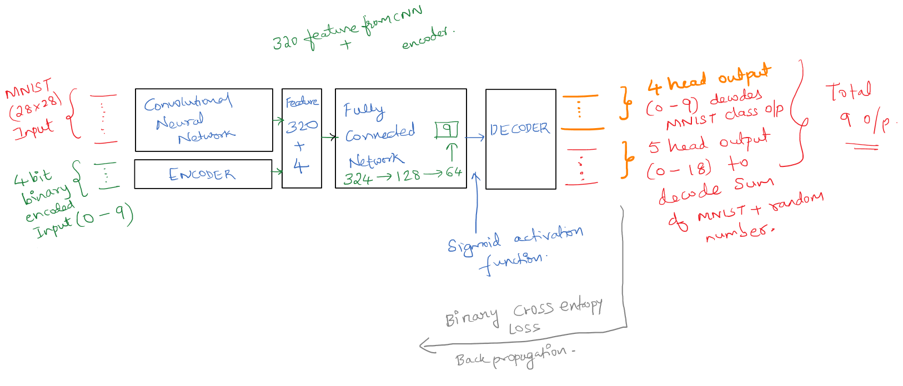
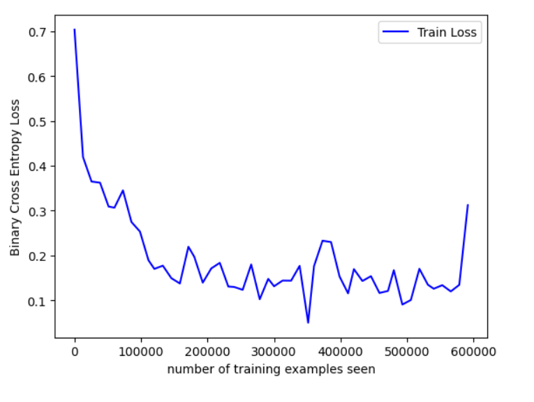
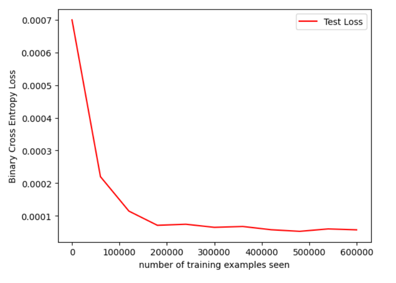

## Neural Network on Steroids!

Implementation of a Neural network take 2 inputs:

1. an image from the MNIST dataset (say 5), and
2. a random number between 0 and 9, (say 7)

and gives two outputs:
1. the "number" that was represented by the MNIST image (predict 5), and
2. the "sum" of this number with the random number and the input image to the network (predict 5 + 7 = 12)


### Data Representation

Out of the `torchvision` MNIST dataset. Normalization is done with the mean of the dataset.


### Data Generation Strategy
`RandomSampler` class to generate random integer between (0 - 9) encoded with 4 bits. Random Sampler batch 
process is in sync with the MNIST batch configuration. The `RandomSampler` class takes batch_size as a 
parameter and `getRandomBatch()` method is called during the training and test loop retrive the synthesized dataset.
This method return a `torch.tensor` which can be directly concatenated with the 1st input to the neural network making
it more compliant.

### Combining 2 inputs
MNIST dataset is passed through the Convolutional neural network where the feature extraction takes place and 320 feature is allowed to pass through the fully connected network. the random 4 bit/head datapoint is fed to fully connected network by concatenating it with MNIST 320 extracted feature. Taking the total sum to 324 features. This is then passed through 3 layers of FCN with hidden layers of size (324 -> 128 -> 64 -> 9).
Why 9 ?
```
First 4 bits of the output encodes the MNIST class, Last 5 bits of the output encodes the sum value ranging from 0-18.
```

### Architecture





### Result evaluation & Selection of loss function.

Comparison of encoded binary vectors with the neural network prediction. 
Using Binary cross entropy (Sigmoid + Cross entropy) to achieve the multi-label classification.
*** Test Accuracy - 95% ***

> notebook also includes the visualization based result comparison of both inputs and outputs. The above 
accuracy is reproducible, added `requirements.txt` with necessary python package dependency as well for the same.


```
Test set: Avg. loss: 0.0007, Accuracy: 0/10000 (0%)

Train Epoch: 1 [0/60000 (0%)]	Loss: 0.704001
Train Epoch: 1 [12800/60000 (21%)]	Loss: 0.419572
Train Epoch: 1 [25600/60000 (43%)]	Loss: 0.364976
Train Epoch: 1 [38400/60000 (64%)]	Loss: 0.362401
Train Epoch: 1 [51200/60000 (85%)]	Loss: 0.309268

Test set: Avg. loss: 0.0002, Accuracy: 3690/10000 (37%)

Train Epoch: 2 [0/60000 (0%)]	Loss: 0.306592
Train Epoch: 2 [12800/60000 (21%)]	Loss: 0.345291
Train Epoch: 2 [25600/60000 (43%)]	Loss: 0.274710
Train Epoch: 2 [38400/60000 (64%)]	Loss: 0.253348
Train Epoch: 2 [51200/60000 (85%)]	Loss: 0.189360

Test set: Avg. loss: 0.0001, Accuracy: 8321/10000 (83%)

Train Epoch: 3 [0/60000 (0%)]	Loss: 0.170133
Train Epoch: 3 [12800/60000 (21%)]	Loss: 0.177237
Train Epoch: 3 [25600/60000 (43%)]	Loss: 0.149321
Train Epoch: 3 [38400/60000 (64%)]	Loss: 0.137563
Train Epoch: 3 [51200/60000 (85%)]	Loss: 0.219527

Test set: Avg. loss: 0.0001, Accuracy: 9292/10000 (93%)

Train Epoch: 4 [0/60000 (0%)]	Loss: 0.197230
Train Epoch: 4 [12800/60000 (21%)]	Loss: 0.139400
Train Epoch: 4 [25600/60000 (43%)]	Loss: 0.171159
Train Epoch: 4 [38400/60000 (64%)]	Loss: 0.183617
Train Epoch: 4 [51200/60000 (85%)]	Loss: 0.130725

Test set: Avg. loss: 0.0001, Accuracy: 9268/10000 (93%)

Train Epoch: 5 [0/60000 (0%)]	Loss: 0.129754
Train Epoch: 5 [12800/60000 (21%)]	Loss: 0.123417
Train Epoch: 5 [25600/60000 (43%)]	Loss: 0.179987
Train Epoch: 5 [38400/60000 (64%)]	Loss: 0.102424
Train Epoch: 5 [51200/60000 (85%)]	Loss: 0.147861

Test set: Avg. loss: 0.0001, Accuracy: 9330/10000 (93%)

Train Epoch: 6 [0/60000 (0%)]	Loss: 0.131330
Train Epoch: 6 [12800/60000 (21%)]	Loss: 0.144059
Train Epoch: 6 [25600/60000 (43%)]	Loss: 0.143825
Train Epoch: 6 [38400/60000 (64%)]	Loss: 0.176876
Train Epoch: 6 [51200/60000 (85%)]	Loss: 0.049987

Test set: Avg. loss: 0.0001, Accuracy: 9332/10000 (93%)

Train Epoch: 7 [0/60000 (0%)]	Loss: 0.176175
Train Epoch: 7 [12800/60000 (21%)]	Loss: 0.232939
Train Epoch: 7 [25600/60000 (43%)]	Loss: 0.229935
Train Epoch: 7 [38400/60000 (64%)]	Loss: 0.153148
Train Epoch: 7 [51200/60000 (85%)]	Loss: 0.115563

Test set: Avg. loss: 0.0001, Accuracy: 9371/10000 (94%)

Train Epoch: 8 [0/60000 (0%)]	Loss: 0.169555
Train Epoch: 8 [12800/60000 (21%)]	Loss: 0.143101
Train Epoch: 8 [25600/60000 (43%)]	Loss: 0.153840
Train Epoch: 8 [38400/60000 (64%)]	Loss: 0.116364
Train Epoch: 8 [51200/60000 (85%)]	Loss: 0.120867

Test set: Avg. loss: 0.0001, Accuracy: 9490/10000 (95%)

Train Epoch: 9 [0/60000 (0%)]	Loss: 0.167260
Train Epoch: 9 [12800/60000 (21%)]	Loss: 0.090536
Train Epoch: 9 [25600/60000 (43%)]	Loss: 0.100709
Train Epoch: 9 [38400/60000 (64%)]	Loss: 0.170303
Train Epoch: 9 [51200/60000 (85%)]	Loss: 0.134729

Test set: Avg. loss: 0.0001, Accuracy: 9443/10000 (94%)

Train Epoch: 10 [0/60000 (0%)]	Loss: 0.125827
Train Epoch: 10 [12800/60000 (21%)]	Loss: 0.133730
Train Epoch: 10 [25600/60000 (43%)]	Loss: 0.119782
Train Epoch: 10 [38400/60000 (64%)]	Loss: 0.134478
Train Epoch: 10 [51200/60000 (85%)]	Loss: 0.312312

Test set: Avg. loss: 0.0001, Accuracy: 9422/10000 (94%)
```





